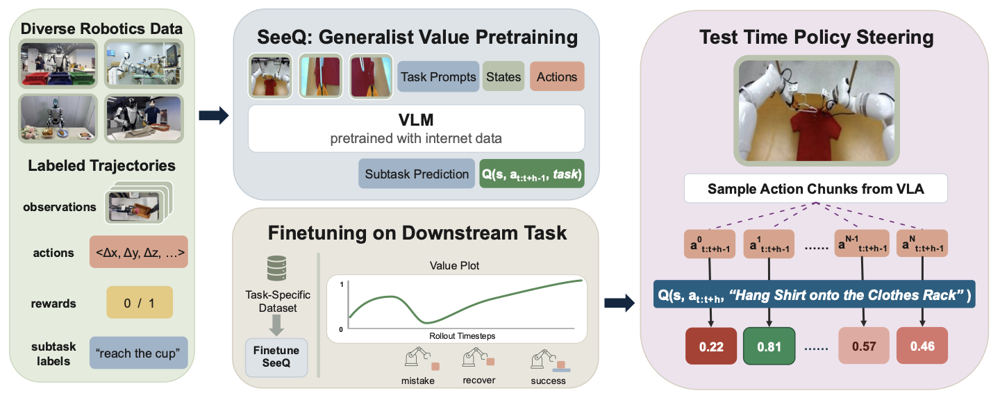

# SeeQ: Training Generalist Value Functions for Long-Horizon Robotic Manipulation

[Project website with videos](https://anonymous.4open.science/w/seeq-iclr-67A3/) · [Pretrained SeeQ-3B checkpoint](https://huggingface.co/seeq-iclr/SeeQ-3B)

Anonymous authors



SeeQ (**S**ubtask-**e**licit**e**d **Q**-functions) trains a generalist Q-function on a
pretrained vision-language backbone (PaliGemma 3B) and uses it to steer a base policy at
test time by best-of-N action selection. Instead of modelling sparse success over a whole
long-horizon task, the Q-function learns the value of the *currently active subtask* with
temporal-difference learning over best-of-N backup candidates (TD-BoN). At inference it
first decodes the active subtask in natural language and then scores each candidate action
chunk conditioned on it.

This repository is a fork of Physical Intelligence's [openpi](https://github.com/Physical-Intelligence/openpi)
(JAX / Flax NNX) extended with critic training, counterfactual-action caching and best-of-N
serving. Use it to fine-tune the released SeeQ-3B critic on your own task data and to steer
a pi-0.5 policy with it.

## Installation

The code targets Python 3.11 and is managed with [uv](https://docs.astral.sh/uv/).

```bash
# download the repository zip from its anonymous link, unzip it and cd into it
uv sync --group rlds          # add --extra gpu on a CUDA host, --extra tpu on a TPU host
```

The RLDS data pipeline depends on TensorFlow-CPU, which only ships Linux wheels; on macOS
the models, tests and the policy server run, but data loading does not.

### Requirements

To run the models in this repository on GPUs you will need NVIDIA GPUs with at least the
following memory. Multiple GPUs on one machine share the load through `--fsdp-devices`;
multi-node training is not supported.

| Mode | Memory required | Example GPUs |
| --- | --- | --- |
| Critic fine-tuning (full, float32) | > 60 GB in total, sharded with `--fsdp-devices` | 2x L40S / A6000 (48 GB), or A100 (80 GB) / H100 |
| Policy fine-tuning (pi-0.5, full) | > 70 GB | A100 (80 GB) / H100 |
| Serving (pi-0.5 policy + critic, best-of-N) | > 40 GB | A100 (80 GB), or 2x 48 GB |

Then set the storage root: open `src/openpi/training/config.py` and replace the
`DATA_ROOT = "gs://CHANGE_ME"` placeholder with a local directory or a GCS bucket. The
configs expect

| Path | Contents |
| --- | --- |
| `datasets/<task>/` | your RLDS dataset, with `norm_stats/` inside |
| `cached_actions/<policy config>/` | the counterfactual action store of your base policy |

Loading a config that still carries the placeholder raises a `ValueError` naming the
offending paths; every field can also be overridden on the command line (for example
`--data.rlds-data-dir`). Checkpoints are written under `--checkpoint-base-dir` (default
`./checkpoints`) as `<checkpoint base>/<config name>/<experiment name>/<step>/`.

## Fine-tuning SeeQ on your task

### 1. Download the pretrained critic

The checkpoint is a single Orbax step directory. Place it where the trainer expects the
pretraining run of its config, `robocoin_bimanual_paligemma_cql_rlds_subtask_ar`, at step
230000:

```bash
export CKPT=./checkpoints
uv run hf download seeq-iclr/SeeQ-3B \
    --local-dir $CKPT/robocoin_bimanual_paligemma_cql_rlds_subtask_ar/seeq/230000
```

It holds parameters only; the trainer creates a fresh optimizer state when it resumes from it.

### 2. Build an RLDS dataset for your task

The data loaders read TFDS/RLDS datasets; build yours with a TFDS builder in the style of
[kpertsch/rlds_dataset_builder](https://github.com/kpertsch/rlds_dataset_builder). Each
step must provide

| Field | Description |
| --- | --- |
| `observation/image/cam_0`, `cam_1`, `cam_2` | RGB images (base, left wrist, right wrist), JPEG-encoded or raw |
| `observation/state` | 14-D bimanual end-effector state: xyz, roll-pitch-yaw and gripper per arm |
| `action` | 14-D end-effector action in the same layout (the loader assembles action chunks) |
| `subtask` | the active subtask as text |
| `steps_to_subtask_end` | steps until the active subtask ends |
| `is_partial` | (optional) True on steps of a subtask that was not completed |

Joint-space data may instead ship joint `observation/state` and `action` together with 12-D
`eef_sim_pose_state` and `eef_sim_pose_action` (xyz and roll-pitch-yaw per arm); with
`use_eef = True` the loader splices in the gripper channels to rebuild the 14-D layout.
Each episode's `episode_metadata` must provide `fps`, `task_description` and `repo_id`. The
source data is expected at 60 Hz; `subsample = True` downsamples it to 30 Hz.

### 3. Register a policy config and a fine-tune config

Add a `TrainConfig` for your base policy and a `FineTuneConfig` for the critic fine-tune to
`src/openpi/training/config.py`, copying `realworld_xarm_packing_pi05_subtask` and
`realworld_xarm_packing_paligemma_cql_rlds_finetune_subtask_ar`. Change

- `datasets` and `repo_id` to your dataset's name and version,
- `counterfactual_action_store_dir` to `f"{DATA_ROOT}/cached_actions/<your policy config>"`,
- `action_horizon` and `td_n` (60 for 60 Hz data; the chunk and the TD backup then cover one second), `discount`, and
- `num_train_steps`, `lr_schedule` and the checkpoint intervals if needed.

`robocoin_bimanual_paligemma_cql_rlds_subtask_ar` is the config the released critic was
trained with and stays the base of every fine-tune: the fine-tune config swaps in your
dataset and counts `num_train_steps` from the pretrained step.

### 4. Compute normalization statistics

```bash
uv run scripts/compute_norm_stats.py --config-name <your policy config>
uv run scripts/compute_norm_stats.py \
    --config-name robocoin_bimanual_paligemma_cql_rlds_subtask_ar --fine-tune <your fine-tune config>
```

[docs/norm_stats.md](docs/norm_stats.md) describes what is computed and the action-space conventions.

### 5. Train the base policy

```bash
uv run scripts/train.py <your policy config> --exp-name <run name> --checkpoint-base-dir $CKPT --overwrite
```

The policy configs start from the released `pi05_base` weights, which download
automatically. We fine-tune pi-0.5 with batch size 128 for 20k to 70k steps depending on
the dataset size.

### 6. Cache counterfactual actions

The TD-BoN backup and best-of-N steering both need N action chunks sampled from the base
policy at every frame. Cache them once per dataset:

```bash
uv run scripts/compute_counterfactual_actions.py worker \
    --config-name <your policy config> \
    --checkpoint-dir $CKPT/<your policy config>/<run name>/<step> \
    --output-dir $DATA_ROOT/cached_actions/<your policy config> \
    --num-samples 8 --num-workers 1 --worker-id 0
uv run scripts/compute_counterfactual_actions.py merge \
    --config-name <your policy config> \
    --checkpoint-dir $CKPT/<your policy config>/<run name>/<step> \
    --output-dir $DATA_ROOT/cached_actions/<your policy config> --num-workers 1
```

Run several `worker` processes with `--num-workers K --worker-id i` to split the episodes
across GPUs; the `launch` subcommand submits them through SLURM. Joint-space policies pass
`--convert-joint-actions-to-eef` so the store holds the critic's end-effector layout.

### 7. Fine-tune the critic

```bash
uv run scripts/train_value_function.py robocoin_bimanual_paligemma_cql_rlds_subtask_ar \
    --exp-name seeq --resume \
    --fine-tune <your fine-tune config> \
    --batch-size 128 --fsdp-devices <number of GPUs> --checkpoint-base-dir $CKPT
```

`--resume` picks up the checkpoint placed in step 1; the fine-tune checkpoints go to
`$CKPT/robocoin_bimanual_paligemma_cql_rlds_subtask_ar/seeq/<fine-tune config>/<step>`.
We fine-tune for 20k steps with batch size 128 (10k for a few-hundred-episode dataset).
Validation plots on held-out episodes are logged to Weights & Biases (`--no-wandb-enabled`
turns logging off). The held-out episodes are cached under `~/.cache/openpi/val_episodes`;
on a multi-host pod without a shared filesystem pass `--fine-tune.validation-cache-dir`
pointing at shared storage, because the validation plot is a collective over all hosts.

### 8. (Optional) Visualize the critic

```bash
uv run scripts/evaluate_value_function.py \
    --config-name robocoin_bimanual_paligemma_cql_rlds_subtask_ar \
    --checkpoint-path $CKPT/robocoin_bimanual_paligemma_cql_rlds_subtask_ar/seeq/<your fine-tune config> \
    --fine-tune <your fine-tune config> --num-trajectories 5
```

This decodes the subtask at every frame of held-out episodes and renders per-episode videos
and plots of predicted values against Monte-Carlo returns, including the value of random,
shuffled and cached counterfactual actions.

### 9. Serve the policy with best-of-N steering

```bash
uv run scripts/serve_policy.py \
    --policy.config <your policy config> --policy.dir $CKPT/<your policy config>/<run name> \
    critic:critic-args \
    --critic.config robocoin_bimanual_paligemma_cql_rlds_subtask_ar \
    --critic.dir $CKPT/robocoin_bimanual_paligemma_cql_rlds_subtask_ar/seeq/<your fine-tune config> \
    --critic.fine-tune-config <your fine-tune config> \
    --critic.num-samples 8 --critic.subtask-decode-every 4 --critic.sample-parallel
```

The server samples N chunks from the policy, decodes the active subtask with the critic
every `subtask-decode-every` calls, scores the candidates and returns the best one. Robot
code talks to it through the lightweight `openpi-client` package; the observation format
and a client snippet are in [docs/remote_inference.md](docs/remote_inference.md), and
`examples/simple_client/main.py` exercises a served checkpoint with random observations.

## Repository map

```
scripts/
  train.py                        pi-0.5 policy training / fine-tuning
  compute_norm_stats.py           normalization statistics for a config
  compute_counterfactual_actions.py
                                  cache N policy samples per frame (worker / merge / launch)
  train_value_function.py         critic fine-tuning (and pretraining)
  evaluate_value_function.py      value curves, subtask decoding and diagnostics on held-out episodes
  serve_policy.py                 websocket policy server, optionally with best-of-N steering
src/openpi/
  training/config.py              DATA_ROOT, data configs, TrainConfig, FineTuneConfig and the registry
  training/lerobot_rlds_dataset.py
                                  RLDS pipeline (subtask rewards, TD targets, counterfactual joins)
  training/counterfactual_action_store.py
                                  on-disk store of cached policy actions
  value_functions/                critics: PaliGemma network, regression head, MC / SARSA / TD-BoN objectives
  models/best_of_n.py             best-of-N wrapper used for the TD backup and at serving time
  models/pi0.py, gemma.py, siglip.py
                                  pi-0.5 policy and its backbones (from openpi)
  policies/best_of_n_policy.py    serving-side policy + critic wrapper
  policies/subtask_decoder.py     autoregressive subtask decoding from a critic
  rlds_utils/                     evaluation utilities and checkpoint loading
packages/openpi-client/           minimal websocket client for robot code
```

## Acknowledgements and license

This repository builds on [openpi](https://github.com/Physical-Intelligence/openpi) by
Physical Intelligence (pi-0.5, the PaliGemma backbone code and the serving stack); the
released critic was pretrained on the [RoboCOIN](https://github.com/RoboCOIN/RoboCOIN)
dataset. The code is released under the [Apache 2.0 license](LICENSE); the PaliGemma and
Gemma weights it loads are subject to the [Gemma terms of use](LICENSE_GEMMA.txt).
